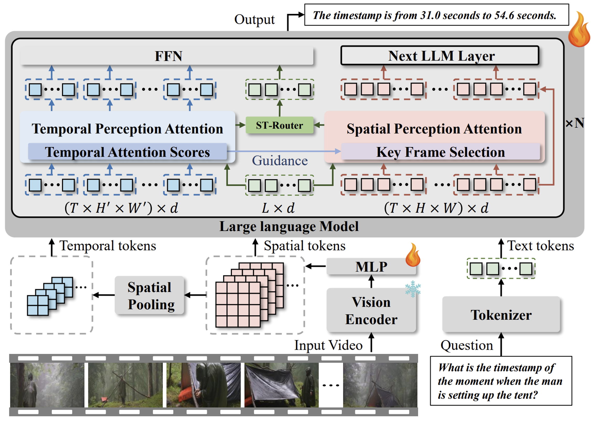

# (ICLR 2026) Divid: Disentangled Spatial-Temporal Modeling within LLMs for Temporally Grounded Video Understanding

  

## Updates

- [ ] Release Divid checkpoints
- [ ] Release evaluation code
- [ ] Release training data